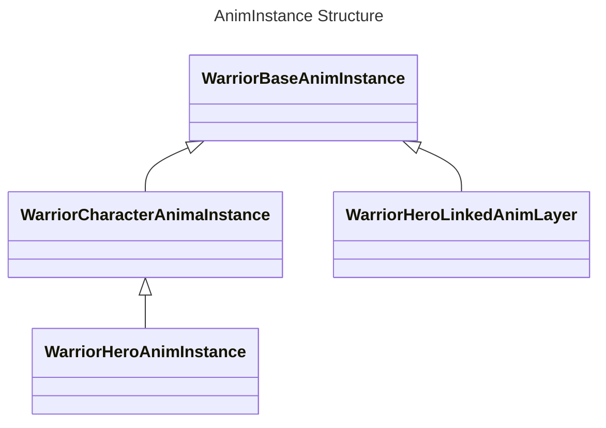

# Warrior UML

```mermaid
---
title: AnimInstance Structure
---
classDiagram
%% Provides Helper functions
%% Shared by player and enemy / For hero weapons
%% Contains code specific for player
WarriorBaseAnimInstance  <|-- WarriorCharacterAnimaInstance
WarriorBaseAnimInstance <|-- WarriorHeroLinkedAnimLayer
WarriorCharacterAnimaInstance <|-- WarriorHeroAnimInstance

```

